Demostrar en deducción natural que las siguientes fórmulas son teoremas **sin usar principios de razonamiento clásico**s salvo que se indique lo contrario. Recordemos que una fórmula σ es un teorema si y sólo si vale ⊢ σ

1. *Modus ponens* relativizado:`(ρ ⇒ σ ⇒ τ ) ⇒ (ρ ⇒ σ) ⇒ ρ ⇒ τ`
2. Reducción al absurdo: `⊢(ρ ⇒ ⊥) ⇒ ¬ρ`
3. Introducción de la doble negación: `ρ ⇒ ¬¬ρ`
4. Eliminación de la triple negación: `¬¬¬ρ ⇒ ¬ρ`
5. Contraposición: `(ρ ⇒ σ) ⇒ (¬σ ⇒ ¬ρ)`
6. Adjunción: `((ρ ∧ σ) ⇒ τ ) ⇔ (ρ ⇒ σ ⇒ τ )`
7. de Morgan (I): `¬(ρ ∨ σ) ⇔ (¬ρ ∧ ¬σ)`
8. de Morgan (II): `¬(ρ ∧ σ) ⇔ (¬ρ ∨ ¬σ)`. Para la dirección ⇒ es necesario usar principios de razonamiento clásicos.
9. Conmutatividad (∧): `(ρ ∧ σ) ⇒ (σ ∧ ρ)`
10. Asociatividad (∧): `((ρ ∧ σ) ∧ τ ) ⇔ (ρ ∧ (σ ∧ τ ))`
11. Conmutatividad (∨): `(ρ ∨ σ) ⇒ (σ ∨ ρ)`
12. Asociatividad (∨): `((ρ ∨ σ) ∨ τ ) ⇔ (ρ ∨ (σ ∨ τ ))`
¿Encuentra alguna relación entre teoremas de adjunción, asociatividad y conmutatividad con algunas de las propiedades demostradas en la práctica 2?

---
## Respuestas
1. *Modus ponens* relativizado:

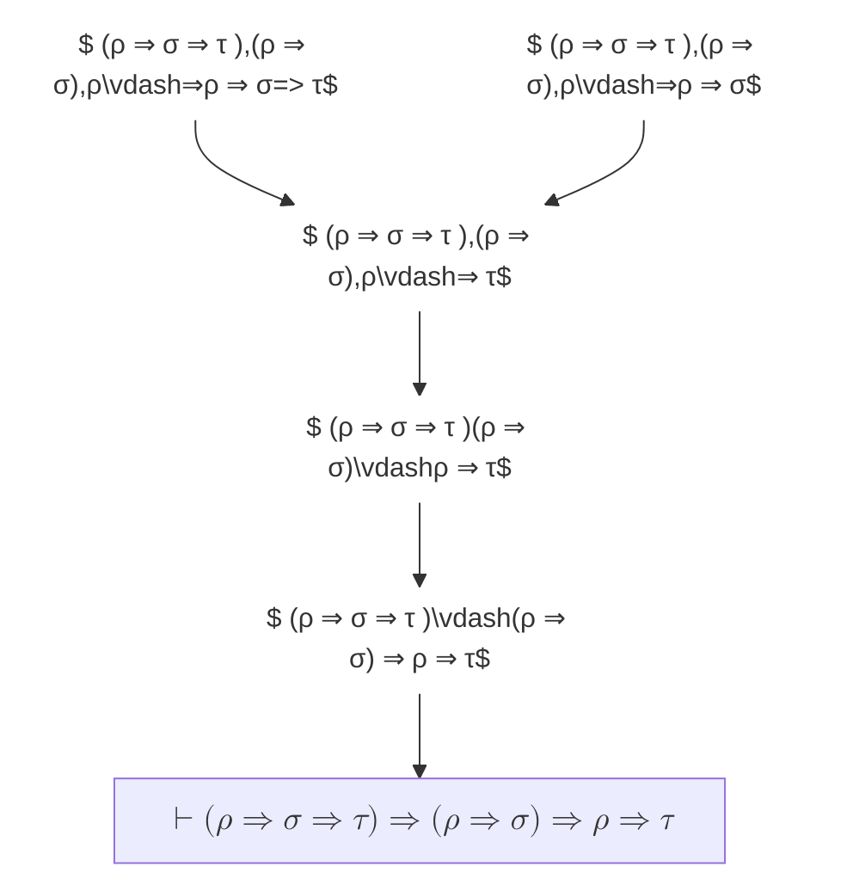

2. Reducción al absurdo:
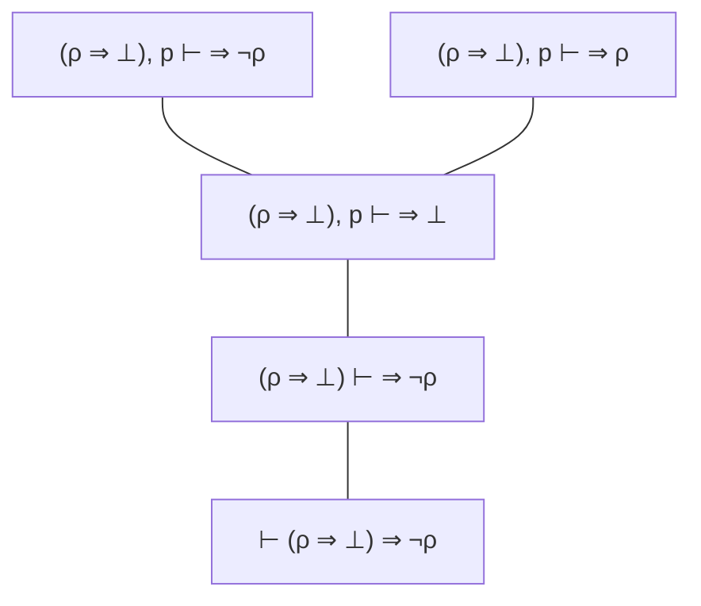
3. Introducción de la doble negación:
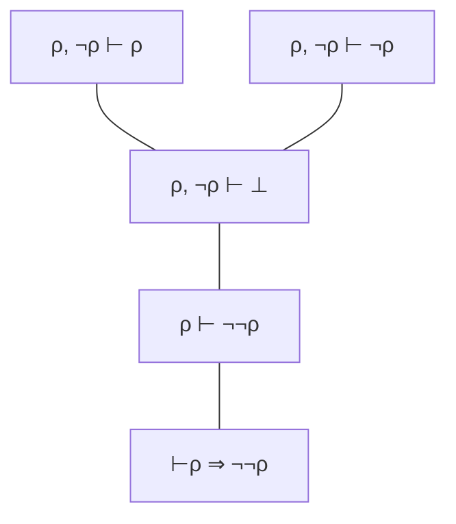
4. Eliminación de la triple negación:
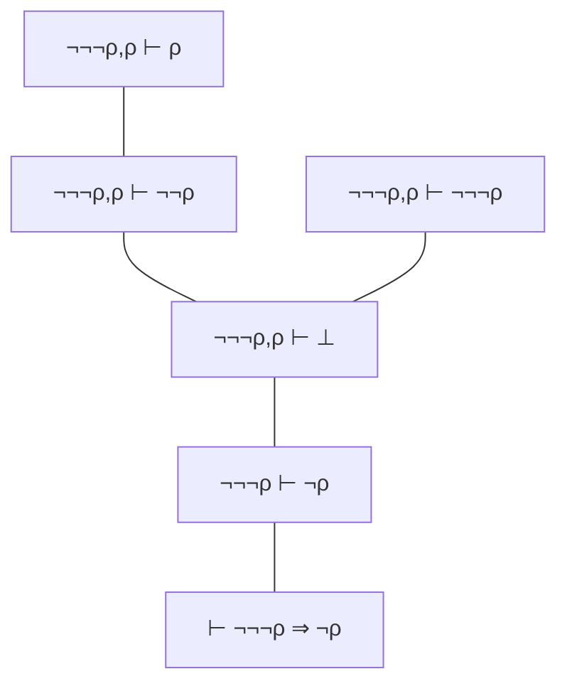

5. Contraposición

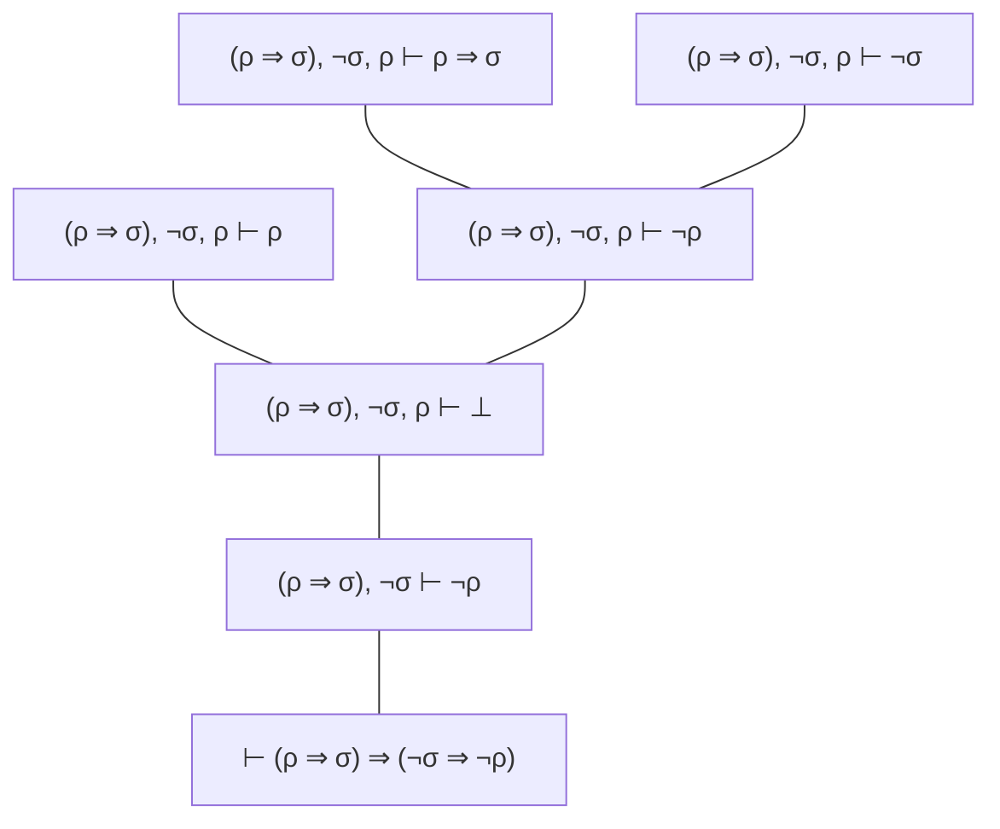
6. Adjunción
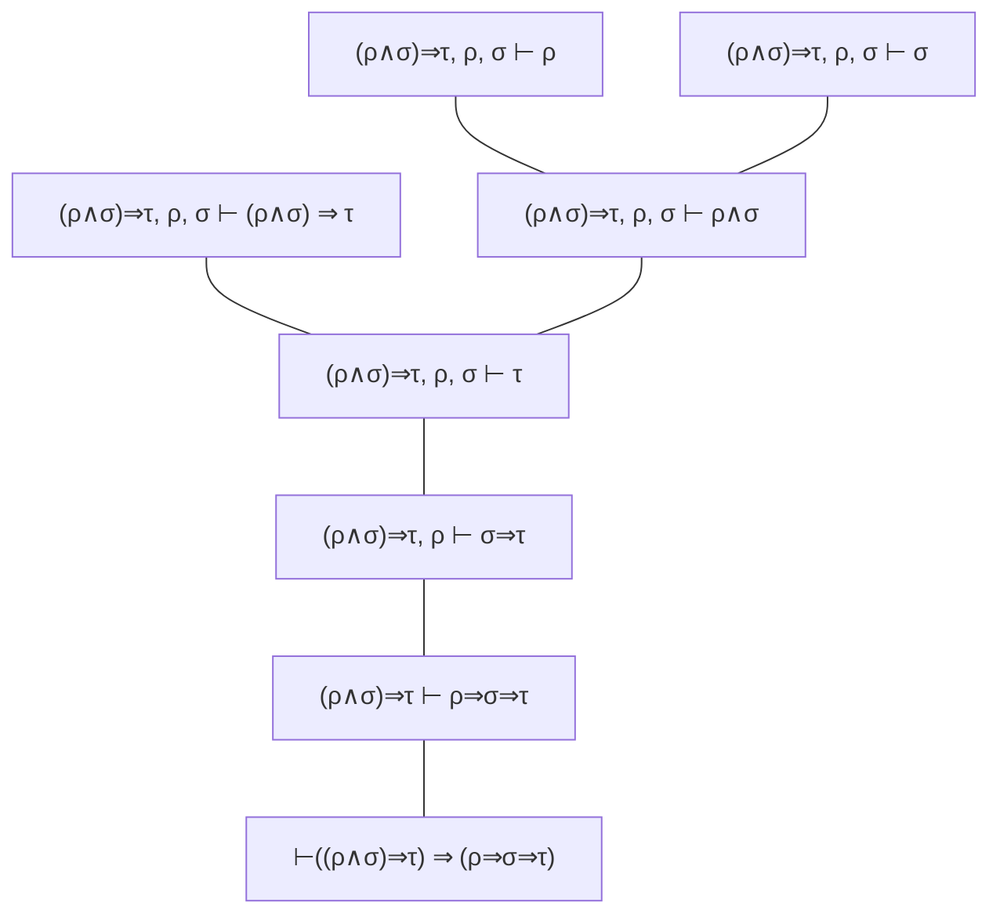

7. de Morgan (I):

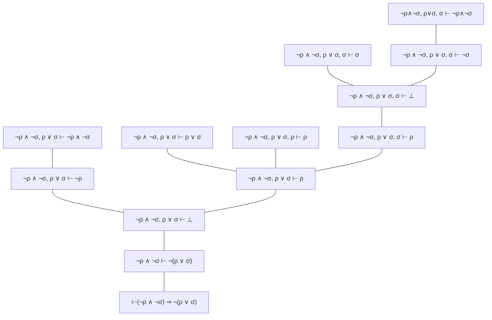
8. de Morgan (II):

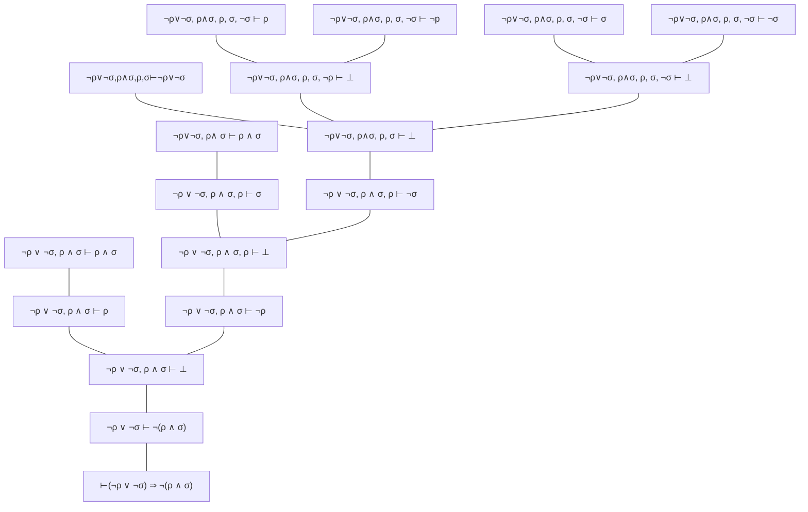
9. Conmutatividad
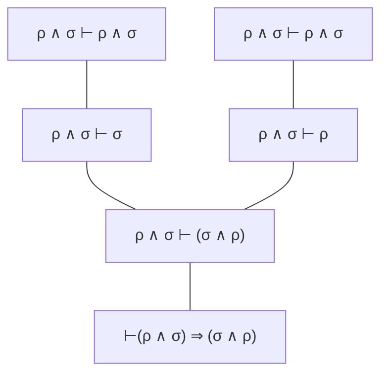

10. Asociatividad
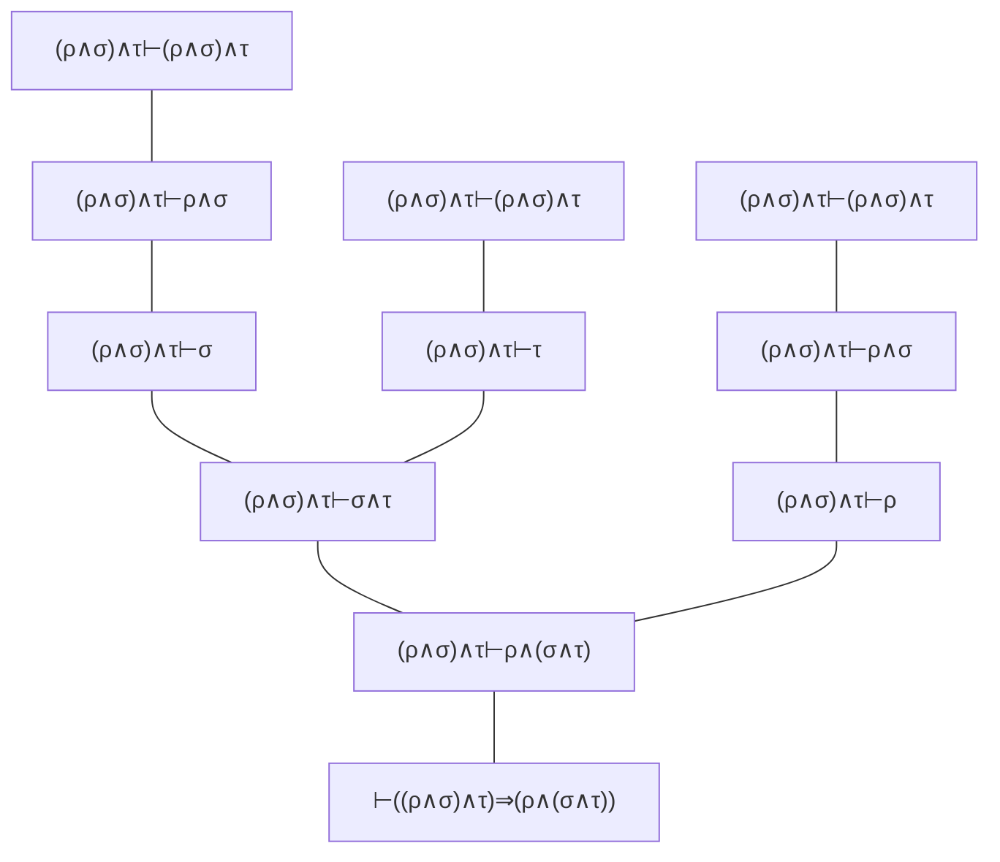

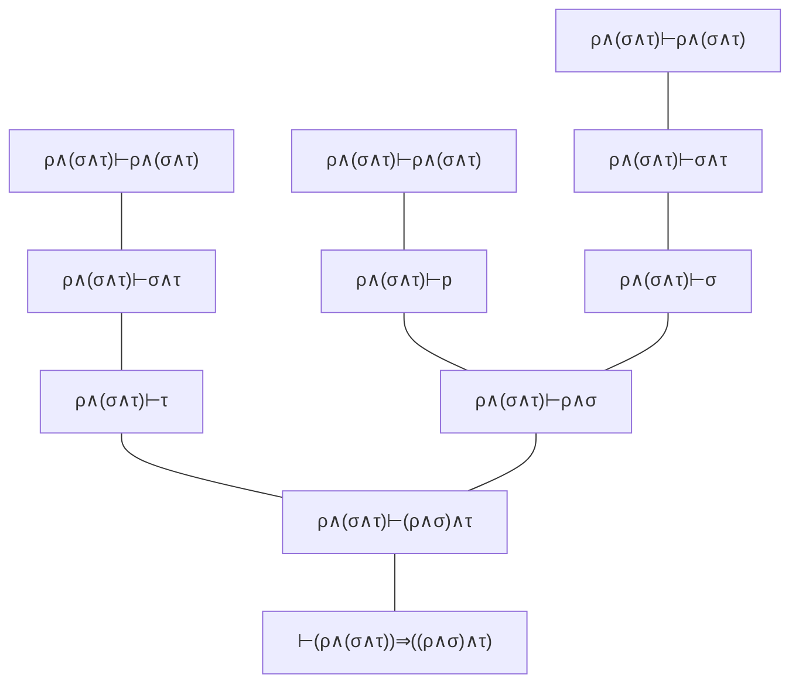
11. Conmutatividad
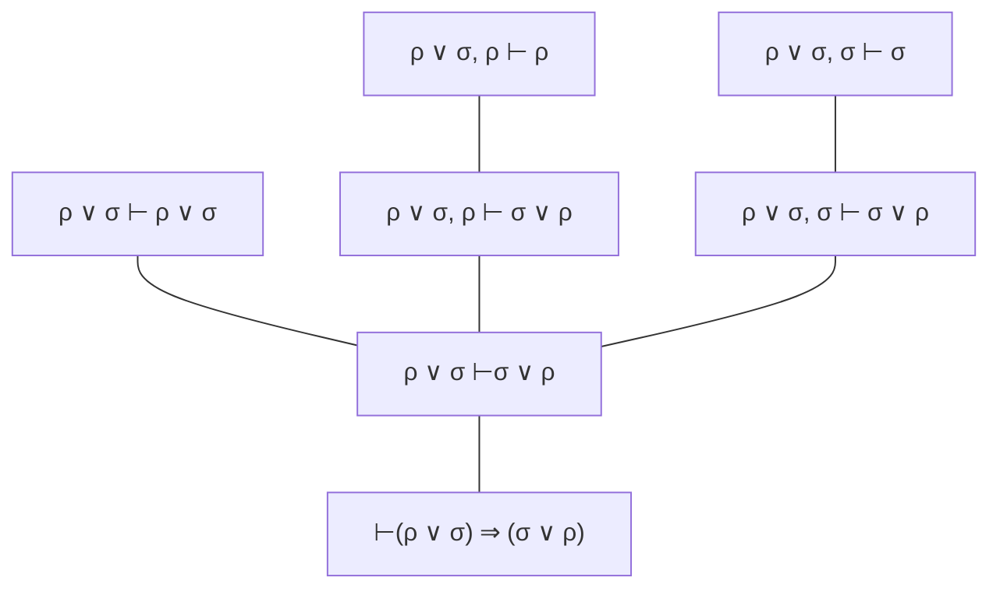
12. Asociatividad
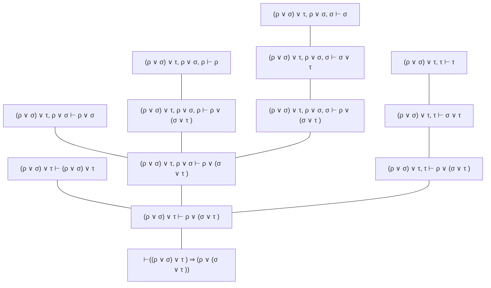

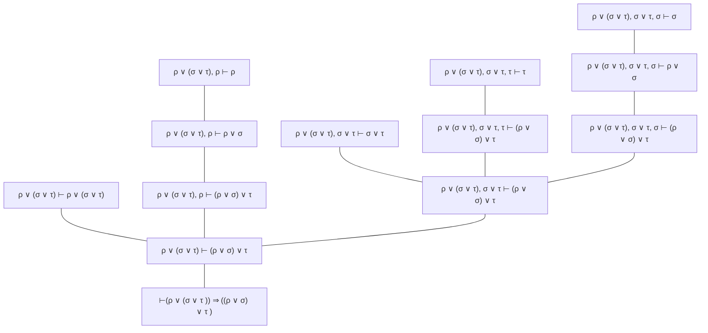
