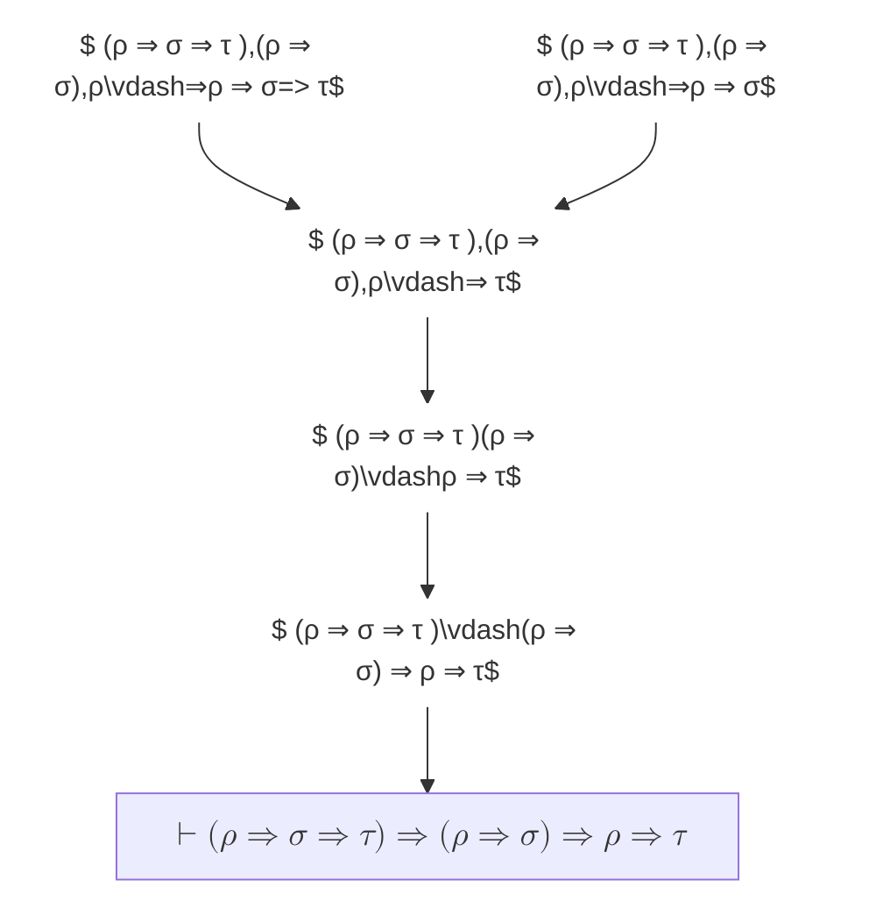
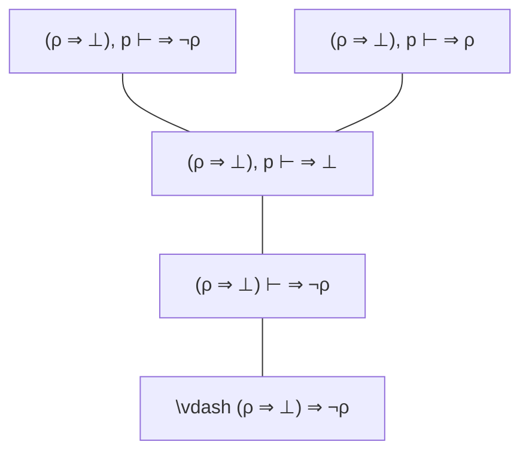
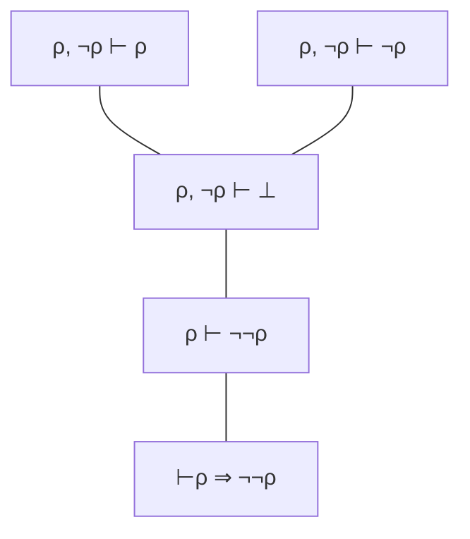
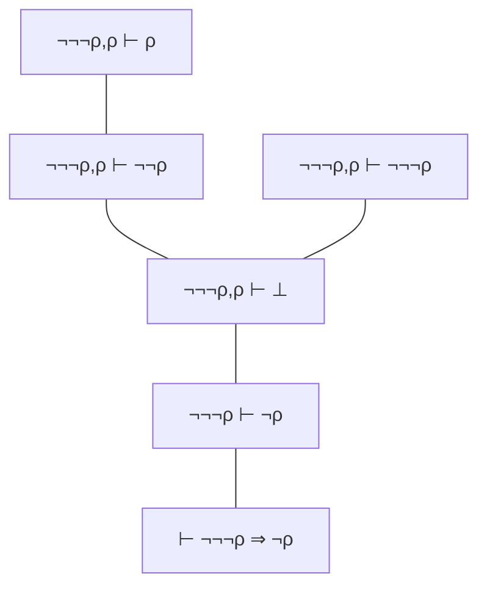
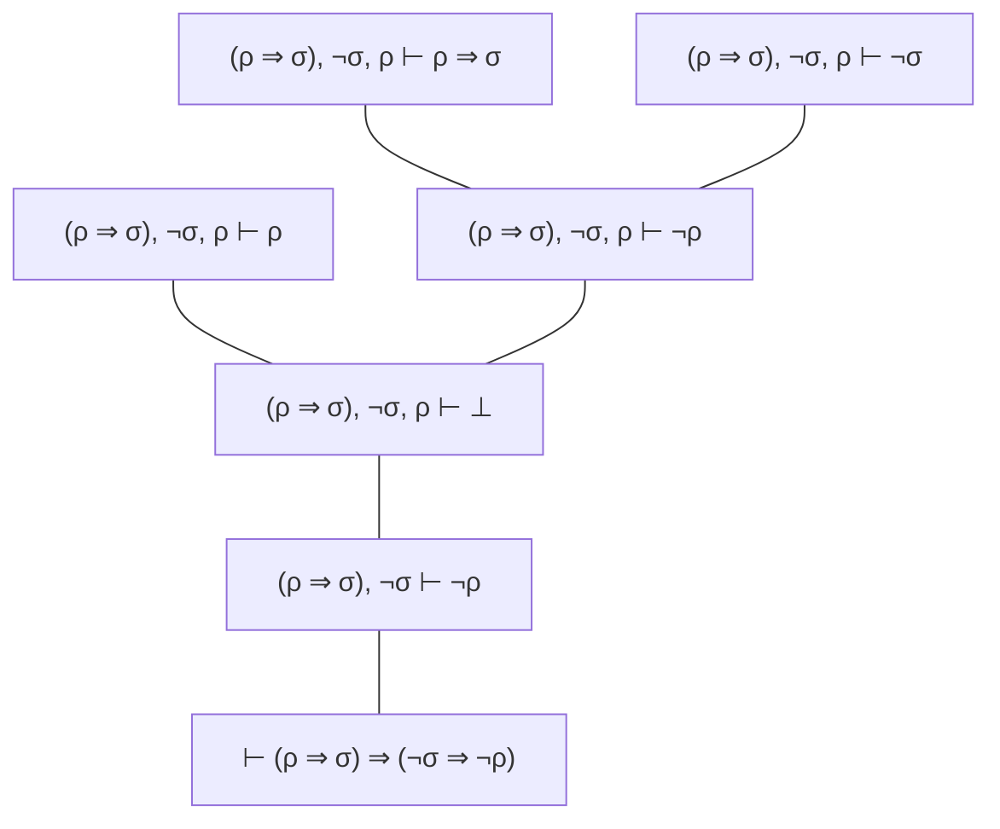

Demostrar en deducción natural que las siguientes fórmulas son teoremas **sin usar principios de razonamiento clásico**s salvo que se indique lo contrario. Recordemos que una fórmula σ es un teorema si y sólo si vale ⊢ σ

1. `(ρ ⇒ σ ⇒ τ ) ⇒ (ρ ⇒ σ) ⇒ ρ ⇒ τ`
2. `⊢(ρ ⇒ ⊥) ⇒ ¬ρ`
3. `ρ ⇒ ¬¬ρ`

---
## Respuestas
1. 

2. 

3. 

4. 

6. 

