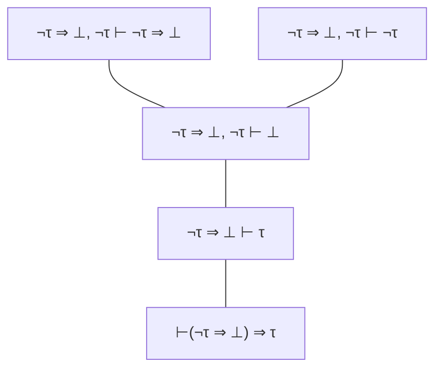

Demostrar en deducción natural que vale `⊢ σ` para cada una de las siguientes fórmulas. Para estas fórmulas es imprescindible usar **lógica clásica**:

1. Absurdo clásico: `(¬τ ⇒ ⊥) ⇒ τ`
2. Ley de Peirce: `((τ ⇒ ρ) ⇒ τ ) ⇒ τ`
3. Tercero excluido: `τ ∨ ¬τ`
4. Consecuencia milagrosa: `(¬τ ⇒ τ ) ⇒ τ`
5. Contraposición clásica: `(¬ρ ⇒ ¬τ ) ⇒ (τ ⇒ ρ)`
6. Análisis de casos: `(τ ⇒ ρ) ⇒ (¬τ ⇒ ρ) ⇒ ρ`
7. Implicación vs. disyunción: `(τ ⇒ ρ) ⇔ (¬τ ∨ ρ)`

---
## Respuestas
1.  Absurdo clásico: `(¬τ ⇒ ⊥) ⇒ τ

2. Tercero excluido: `τ ∨ ¬τ`

3. Consecuencia milagrosa: `(¬τ ⇒ τ ) ⇒ τ`

4. Contraposición clásica: `(¬ρ ⇒ ¬τ ) ⇒ (τ ⇒ ρ)`

5. Análisis de casos: `(τ ⇒ ρ) ⇒ (¬τ ⇒ ρ) ⇒ ρ`

6. Implicación vs. disyunción: `(τ ⇒ ρ) ⇔ (¬τ ∨ ρ)

