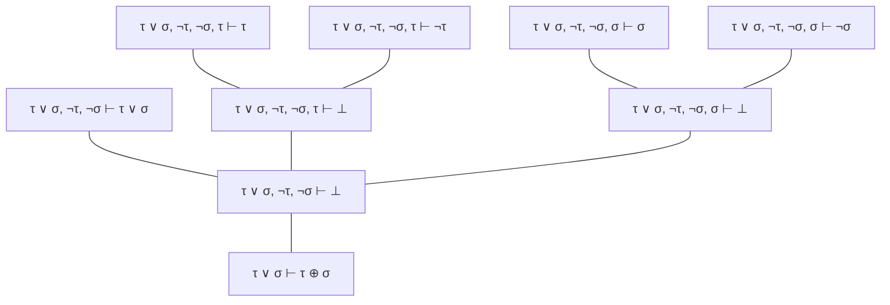
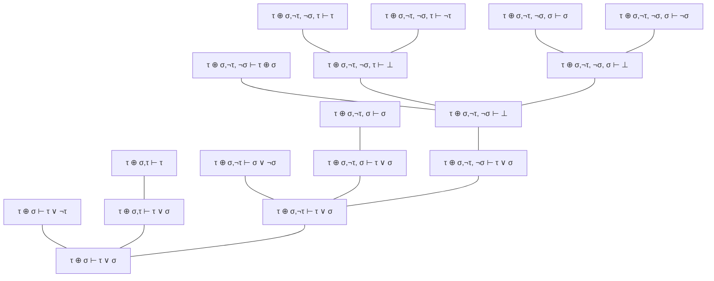

Se define un nuevo conectivo binario $\oplus$ con las siguientes reglas de introducción y eliminación

	$$\frac{\Gamma, \neg \tau, \neg\sigma \vdash \bot} 
	{\Gamma\vdash\tau\oplus\sigma}\oplus i$$
$$\frac{\Gamma \vdash \tau\oplus\sigma \qquad 
\Gamma,\tau\vdash \bot  \qquad
\Gamma, \sigma \vdash\bot
}
       {\Gamma \vdash \bot} \oplus e$$
   Dar las derivaciones para los siguientes secuentes
   1. $\tau \lor \sigma \vdash \tau\oplus\sigma$ 
   2. $\tau\oplus\sigma\vdash\tau\lor\sigma$ 

---
## Respuestas
1. 

2. 

