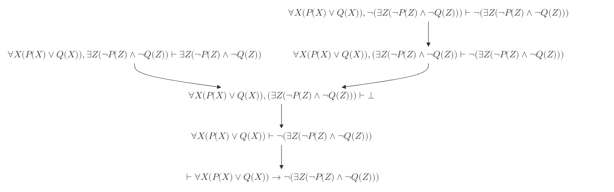

Demostrar con deducción natural que:

$$∀X(P(X)∨Q(X)) → ¬(∃Z(¬P(Z)∧¬Q(Z)))$$

```mermaid
flowchart TD

    n2@{ label: "<span style=\"padding-left:\">$$ \\forall X(P(X)\\lor Q(X)) \\vdash \\neg(\\exists Z(\\neg P(Z) \\land \\neg Q(Z)))$$</span>" } --> n1["$$\vdash \forall X(P(X)\lor Q(X)) \rightarrow \neg(\exists Z(\neg P(Z) \land \neg Q(Z)))$$"]

    n3@{ label: "<span style=\"padding-left:\"><span style=\"padding-left:\">$$ \\forall X(P(X)\\lor Q(X)), (\\exists Z(\\neg P(Z) \\land \\neg Q(Z))) \\vdash \\bot$$</span></span>" } --> n2

    n4@{ label: "<span style=\"padding-left:\"><span style=\"padding-left:\"><span style=\"padding-left:\">$$ \\forall X(P(X)\\lor Q(X)), \\exists Z(\\neg P(Z) \\land \\neg Q(Z)) \\vdash \\exists Z(\\neg P(Z) \\land \\neg Q(Z))$$</span></span></span>" } --> n3

    n5@{ label: "<span style=\"padding-left:\"><span style=\"padding-left:\"><span style=\"padding-left:\">$$ \\forall X(P(X)\\lor Q(X)), (\\exists Z(\\neg P(Z) \\land \\neg Q(Z)) \\vdash \\neg(\\exists Z (\\neg P(Z) \\land \\neg Q(Z)))$$</span></span></span>" } --> n3

    n7@{ label: "<span style=\"padding-left:\"><span style=\"padding-left:\"><span style=\"padding-left:\">$$ \\forall X(P(X)\\lor Q(X)), \\neg(\\exists Z(\\neg P(Z) \\land \\neg Q(Z))) \\vdash \\neg(\\exists Z(\\neg P(Z) \\land \\neg Q(Z)))$$</span></span></span>" } --> n5

    n6["<br>"]

  

    n2@{ shape: text}

    n1@{ shape: text}

    n3@{ shape: text}

    n4@{ shape: text}

    n5@{ shape: text}

    n7@{ shape: text}

    n6@{ shape: text}
```
